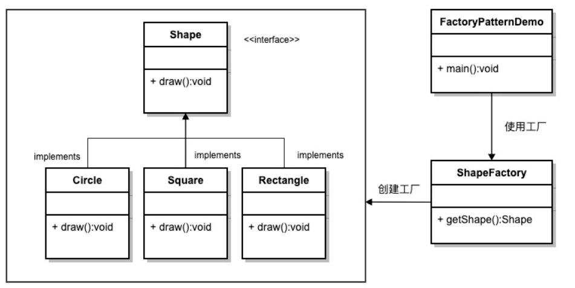

## 工厂模式

工厂模式（Factory Pattern）是 Java 中最常用的设计模式之一。这种类型的设计模式属于创建型模式，它提供了一种创建对象的最佳方式。

在工厂模式中，我们在创建对象时不会对客户端暴露创建逻辑，并且是通过使用一个共同的接口来指向新创建的对象。

### 介绍

**意图：** 定义一个创建对象的接口，让其子类自己决定实例化哪一个工厂类，工厂模式使其创建过程延迟到子类进行。

**主要解决：** 接口选择的问题。

**优点：**

1. 一个调用者想创建一个对象，只需要知道名称就可以了。
2. 扩展性高，如果想增加一个产品，只需要扩展一个工厂类就可以。
3. 屏蔽产品的具体实现，调用者只关心产品的接口。

**缺点：**

每增加一个产品，都需要增加一个具体类和对象实现工厂，使得系统中类的个数成倍增加，在一定程度上增加了系统的复杂度，同时也增加了系统具体类的依赖。

### 实现

