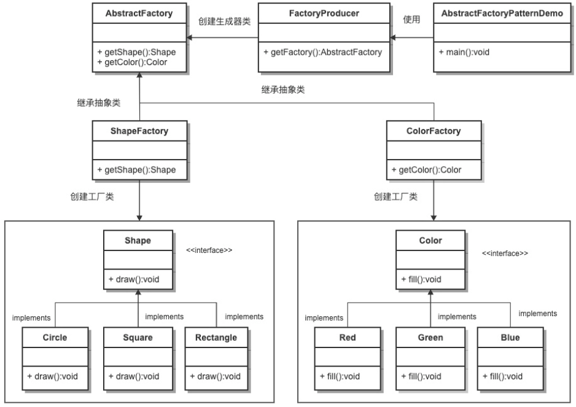

## 二、抽象工厂模式

抽象工厂模式（Abstract Factory Pattern）是围绕一个超级工厂创建其他工厂。该超级工厂又称为其他工厂的工厂。
这种类型的设计模式属于创建型模式，它提供了一种创建对象的最佳方式。

在抽象工厂模式中，接口是负责创建一个相关对象的工厂，不需要显式指定它们的类。每个生成的工厂都能按照工厂模式提供对象。

### 介绍

**意图：** 提供一个创建一系列相关或相互依赖对象的接口，而无需指定它们具体的类。

**主要解决：** 接口选择的问题。

**优点：**

当一个产品族中多个对象被设计成一起工作时，它能保证客户端只使用同一个产品族中的对象。

**缺点：**

产品族扩展十分困难，要增加一个系列的一个产品，既要在 Creator 里加代码，又要在具体的里面加代码。

### 实现

