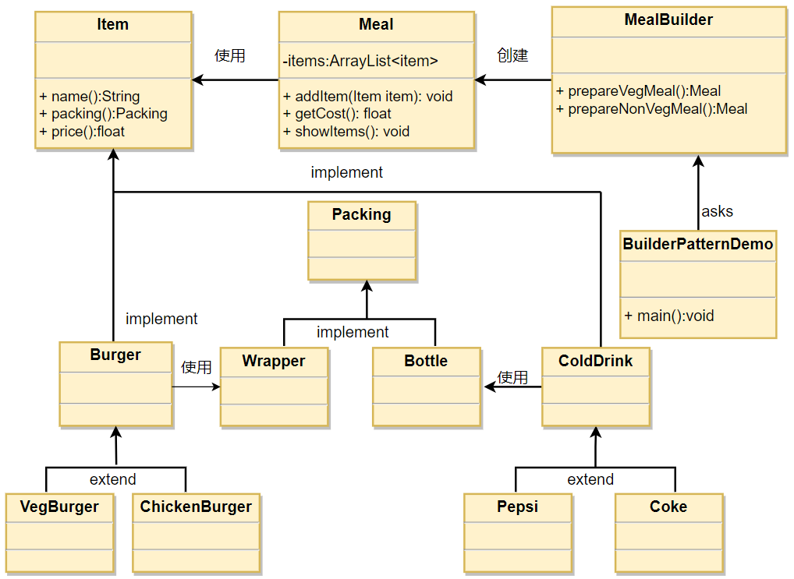

## 建造者模式

建造者模式（Builder Pattern）使用多个简单的对象一步一步构建成一个复杂的对象。这种类型的设计模式属于创建型模式，它提供了一种创建对象的最佳方式。

一个 Builder 类会一步一步构造最终的对象。该 Builder 类是独立于其他对象的。

### 介绍

**意图：** 将一个复杂的构建与其表示相分离，使得同样的构建过程可以创建不同的表示

**主要解决：** 在软件系统中，有时候面临着‘一个复杂对象’的创建工作，其通常由各个部分的子对象用一定的算法构成；
由于需求的变化，这个复杂对象的各个部分通常面临着剧烈的变化，但是将它们组合在一起的算法却相对稳定。

**优点：**

1. 建造者独立，易扩展。
2. 便于控制细节风险。

**缺点：**

1. 产品必须有共同点，范围有限制。
2. 如果内部变化复杂，会有很多建造类。

### 实现

