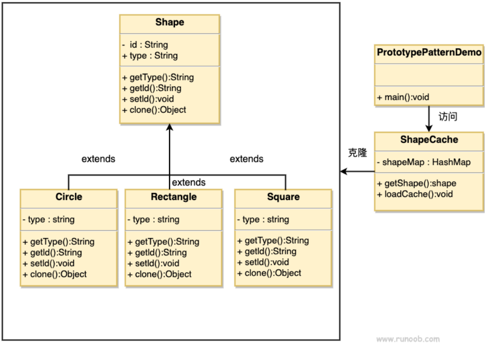

## 原型模式

原型模式（Prototype Pattern）是用于创建重复的对象，同时又能保证性能。这种类型的设计模式属于创建型模式，它提供了一种创建对象的最佳方式。

这种模式是实现了一个原型接口，该接口用于创建当前对象的克隆。当直接创建对象的代价比较大时，则采用这种模式。
例如，一个对象需要在一个高代价的数据库操作之后被创建。我们可以缓存该对象，在下一个请求时返回它的克隆，在需要的时候更新数据库，以此来减少数据库调用。

### 介绍

**意图：** 用原型实例指定创建对象的种类，并且通过拷贝这些原型创建新的对象。

**主要解决：** 在运行期建立和删除原型。

**优点：**

1. 性能提高
2. 逃避构造函数的约束

**缺点：**

1. 配备克隆方法需要对类的功能进行通盘考虑，这对于一个全新的类不是很难，但对于已有的类不一定很容易，特别当一个类引用不支持串行化的间接对象，或者引用含有循环结构的时候。
2. 必须实现Cloneable接口。

### 注意事项

与通过对一个类进行实例化来构造新对象不同的是，原型模式是通过拷贝一个现有对象生成新对象的。
浅拷贝实现Cloneable，重写，深拷贝是通过实现Serializable读取二进制流。

### 实现

