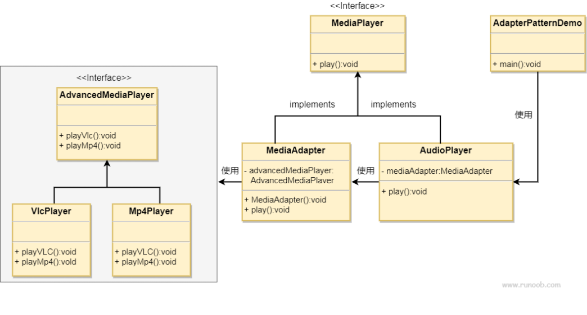

## 适配器模式

适配器模式（Adapter Pattern）是作为两个不兼容的接口之间的桥梁。这种类型的设计模式属于结构型模式，它结合了两个独立接口的功能。

这种模式涉及到一个单一的类，该类负责加入独立的或不兼容的接口功能。

###  介绍

**意图：** 将一个类的接口转换成客户希望的另一个接口。适配器模式使得原本因为接口不兼容而无法一起工作的类可以一起工作。

**主要解决：** 在软件系统中，常常要将一些“现存的对象”放到新的环境中，而新环境要求的接口是现有对象不能满足的。

**优点：**

1. 可以让任意两个没有关联的类一起运行
2. 提高了类的复用
3. 增加了类的透明度
4. 灵活性好

**缺点：**

1. 过多的使用适配器，会让系统非常凌乱，不易整体进行把握。
2. 由于Java至多继承一个类，所以至多只能适配一个适配者类，而且目标类必须是抽象类。

### 实现

