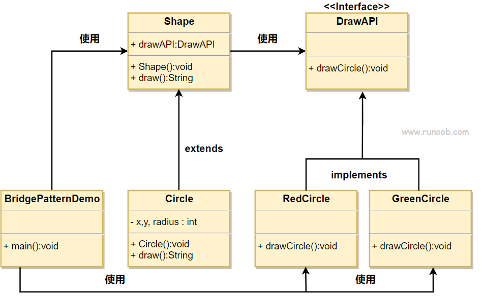

##  桥接模式

桥接（Bridge）是用于把抽象化与实现化解耦，使得二者可以独立变化。这种类型的设计模式属于结构型模式，它通过提供抽象化和实现化之间的桥接结构，来实现二者的解耦。

这种模式涉及到一个作为桥接的接口，使得实体类的功能独立于接口实现类。这两种类型的类可被结构化改变而互不影响。

### 介绍

**意图：**  将抽象部分与实现部分分离，使它们都可以独立的变化。

**主要解决：** 在有多种可能会变化的情况下，用继承会造成类爆炸问题，扩展起来不灵活。

**优点：**

1. 抽象和实现的分离
2. 优秀的扩展能力
3. 实现细节对客户透明

**缺点：**

桥接模式的引入会增加系统的理解与设计难度，由于聚合关联关系建立在抽象层，要求开发者针对抽象进行设计与编程。

**注意事项：** 对于两个独立变化的维度，使用桥接模式再适合不过了。

### 实现

