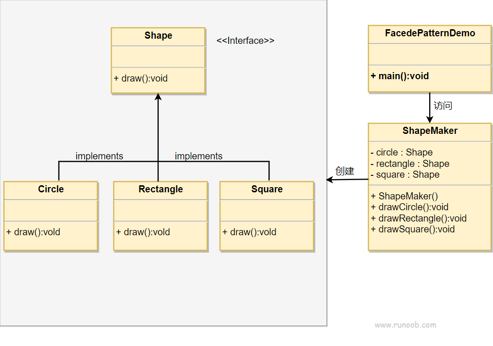

## 外观模式

外观模式（Facade Pattern）隐藏系统的复杂性，并向客户端提供了一个客户端可以访问系统的接口。这种类型的设计模式属于结构型模式，它向现有的系统添加一个接口，来隐藏系统的复杂性。

这种模式涉及到一个单一的类，该类提供了客户端请求的简化方法和对现有系统类方法的委托调用。

### 介绍

**意图：** 为子系统中的一组接口提供一个一致的界面，外观模式定义了一个高层接口，这个接口使得这一子系统更加容易使用。

**主要解决：** 降低访问复杂系统的内部子系统的复杂度，简化客户端与之的接口。

**优点：**

1. 减少系统相互依赖
2. 提高灵活性
3. 提高了安全性

**缺点：**

不符合开闭原则，如果要改东西很麻烦，继承重写都不合适。

**注意事项：** 在层次化结构中，可以使用外观模式定义系统中每一层的入口。

### 实现

