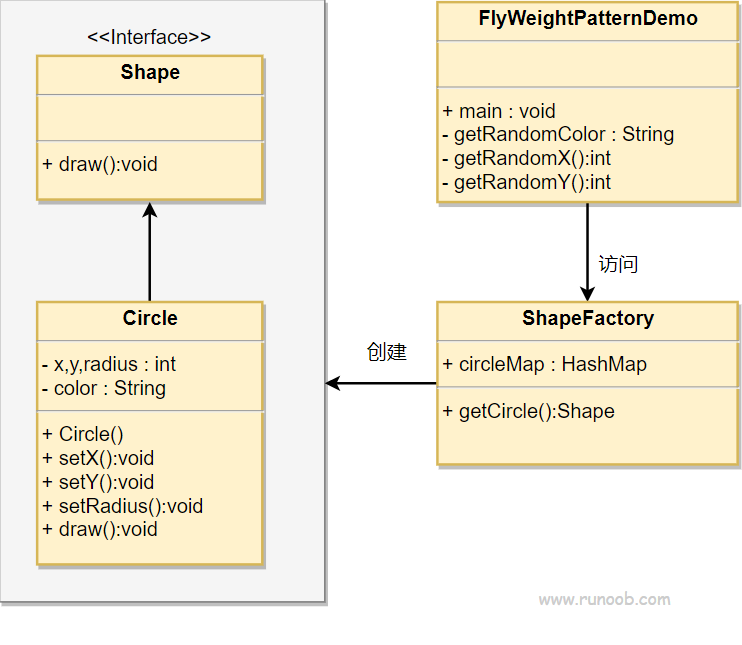

## 享元模式

享元模式（Flyweight Pattern）主要用于减少创建对象的数量，以减少内存占用和提高性能。这种类型的设计模式属于结构型模式，它提供了减少对象数量从而改善应用所需的对象结构的方式。

享元模式尝试重用现有的同类对象，如果未找到匹配的对象，则创建新对象。

### 介绍

**意图：** 运用共享技术有效支持大量细粒度的对象。

**主要解决：** 在有大量对象时，有可能会造成对象溢出，我们把其中共同的部分抽象出来，如果有相同的业务请求，直接返回在内存中已有的对象，避免重新创建。

**优点：**

大大减少对象的创建，降低系统的内存，使效率提高。

**缺点：**

提高了系统的复杂度，需要分离出外部状态和内部状态，而且外部状态具有固有化的性质，不应该随着内部状态的变化而变化，否则会造成系统的混乱。

**注意事项：** 
1. 注意划分外部状态和内部状态，否则可能会引起线程安全问题
2. 这些类必须有一个工厂对象加以控制

### 实现

