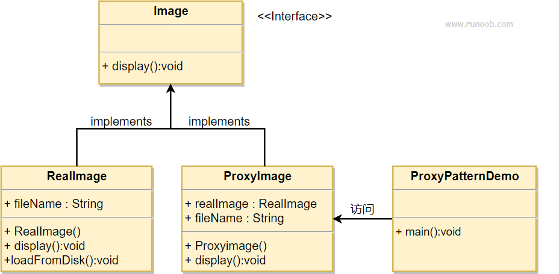

## 代理模式

在代理模式（Proxy Pattern）中，一个类代表另一个类的功能。这种类型的设计模式属于结构型模式。

在代理模式中，我们创建具有现有对象的对象，以便向外界提供功能接口。

### 介绍

**意图：** 为其他对象提供一种代理以控制对该对象的访问。

**主要解决：** 在直接访问对象时带来的问题。

**优点：**

1. 职责清晰
2. 高扩展性
3. 智能化

**缺点：**

1. 由于在客户端和真实主题之间增加了代理对象，因此有些类型的代理模式可能会造成请求的处理速度变慢。
2. 实现代理模式需要额外的工作，有些代理模式的实现非常复杂。

**注意事项：**
1. 和适配器模式的区别：适配器模式主要改变所考虑对象的接口，而代理模式不能改变所代理对象的接口。
2. 和装饰器模式的区别，装饰器模式为了增强功能，而代理模式是为了加以控制。

### 实现

