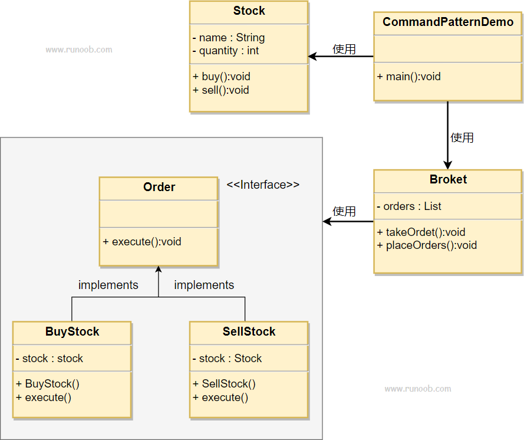

## 命令模式

命令模式（Command Pattern）是一种数据驱动的设计模式，它属于行为型模式。请求以命令的形式包裹在对象中，并传给调用对象。调用对象寻找可以处理该命令的合适的对象，并把该命令传给相应的对象，该对象执行命令。

### 介绍

**意图：** 将一个请求封装成一个对象，从而可以用不同的请求对客户进行参数化。

**主要解决：** 在软件系统中，行为请求者与行为实现者通常是一种紧耦合的关系，
但某些场合，比如需要对行为进行记录、撤销或重做、事务等处理时，这种无法抵御变化的紧耦合的设计就不太合适。

**优点：**
1. 降低了系统耦合度
2. 新的命令可以很容易添加到系统中去

**缺点：**

使用命令模式可能会导致某些系统有过多的具体命令类

**注意事项：** 系统需要支持命令的撤销(Undo)和恢复(Redo)操作

### 实现

