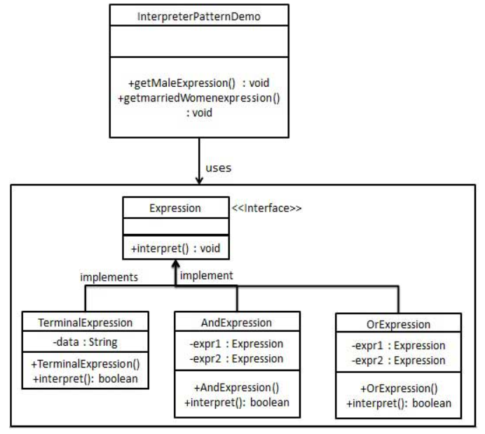

## 解释器模式

解释器模式（Interpreter Pattern）提供了评估语言的语法或表达式的方式，它属于行为型模式。
这种模式实现了一个表达式接口，该接口解释一个特定的上下文。这种模式被用在 SQL 解析、符号处理引擎等。

### 介绍

**意图：** 给定一个语言，定义它的文法表示，并定义一个解释器，这个解释器使用该标示来解释语言中的句子。

**主要解决：** 对于一些固定文法构建一个解释句子的解释器

**优点：**
1. 可扩展性比较好，灵活
2. 增加了新的解释表达式的方式
3. 易于实现简单文法

**缺点：**
1. 可利用场景比较少
2. 对于复杂的文法比较难维护
3. 解释器模式会引起类膨胀
4. 解释器模式采用递归调用方法

**注意事项：** 可利用场景比较少，Java中如果碰到可以用expression4J代替

### 实现

