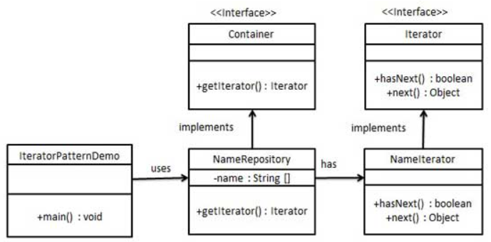

## 迭代器模式

迭代器模式（Iterator Pattern）是 Java 和 .Net 编程环境中非常常用的设计模式。这种模式用于顺序访问集合对象的元素，不需要知道集合对象的底层表示。

迭代器模式属于行为型模式。

### 介绍

**意图：** 提供一种方法顺序访问一个聚合对象中各个元素，而又无需暴露该对象的内部表示。

**优点：**
1. 支持以不同的方式遍历一个聚合对象
2. 迭代器简化了聚合类
3. 在同一个聚合上可以有多个遍历
4. 在迭代器模式中，增加新的聚合类和迭代器类都很方便，无需修改原有代码

**缺点：** 由于迭代器模式将存储数据和遍历数据的职责分离，增加新的聚合类需要对应增加新的迭代器类，类的个数成对增加，这在一定程度上增加了系统的复杂性

**注意事项：** 迭代器模式就是分离了集合对象的遍历行为，抽象出一个迭代器类来负责，这样既可以做到不暴露集合的内部结构，又可以让外部代码透明地访问集合内部的数据。

### 实现

