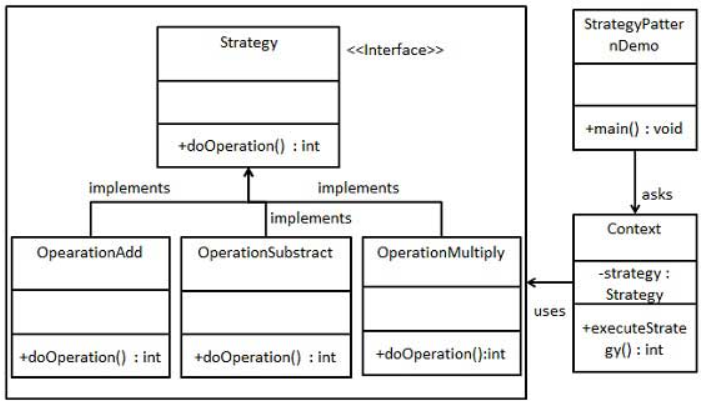

## 策略模式

在策略模式（Strategy Pattern）中，一个类的行为或其算法可以在运行时更改。这种类型的设计模式属于行为型模式。

在策略模式中，我们创建表示各种策略的对象和一个行为随着策略对象改变而改变的 context 对象。策略对象改变 context 对象的执行算法。

### 介绍

**意图：** 定义一系列的算法，把它们一个个封装起来，并且使它们可以相互替换。

**主要解决：** 在有多种算法相似的情况下，使用 if...else 所带来的复杂和难以维护。

**优点：** 
1. 算法可以自由切换
2. 避免使用多重条件判断
3. 扩展性良好

**缺点：** 
1. 策略类会增多
2. 所有策略类都需要对外暴露

**注意事项：** 如果一个系统的策略多于四个，就需要考虑使用混合模式，解决策略类膨胀的问题。

### 实现

