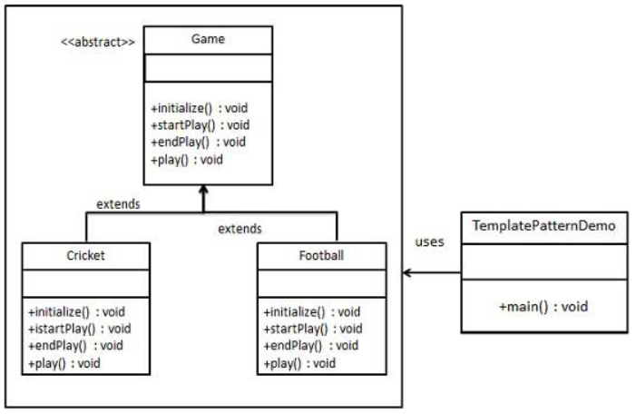

## 模板模式

在模板模式（Template Pattern）中，一个抽象类公开定义了执行它的方法的方式/模板。它的子类可以按需要重写方法实现，但调用将以抽象类中定义的方式进行。这种类型的设计模式属于行为型模式。

### 介绍

**意图：** 定义一个操作中的算法的骨架，而将一些步骤延迟到子类中。模板方法使得子类可以不改变一个算法的结构即可冲定义该算法的某些特定步骤。

**主要解决：** 一些方法通用，却在每个子类都重写了这个方法。

**优点：** 
1. 封装不变部分，扩展可变部分
2.  提取公共代码，便于维护
3. 行为由父类控制，子类实现

**缺点：** 每一个不同的实现都需要一个子类来实现，导致类的个数增多，使得系统更加庞大。

**注意事项：** 为防止恶意操作，一般模板方法都加上`final`关键字。

### 实现

