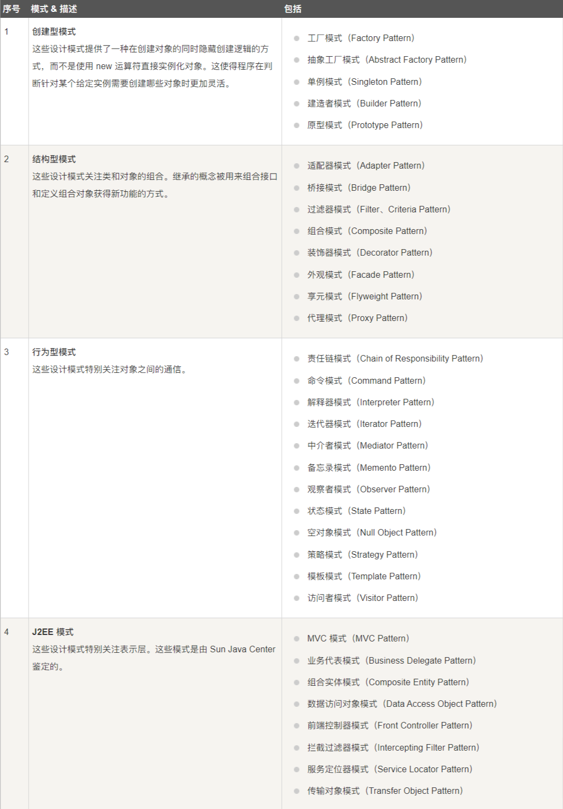
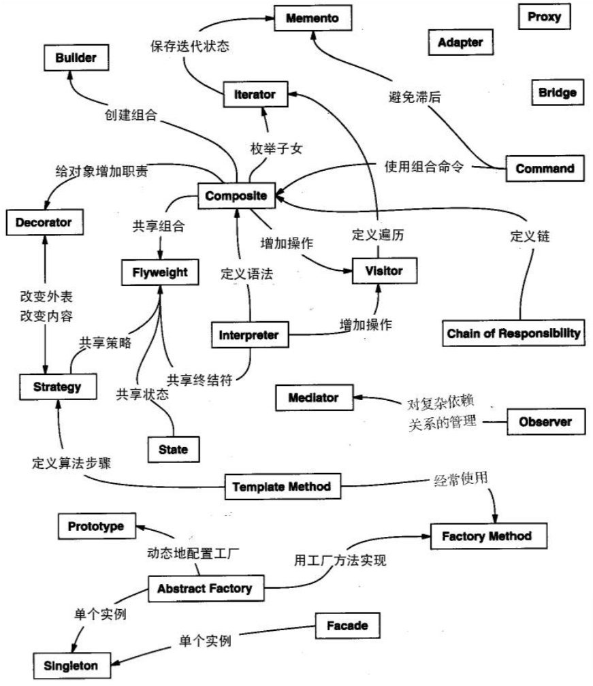

# 设计模式学习笔记

> 原文：[菜鸟教程](https://www.runoob.com/design-pattern/design-pattern-tutorial.html)

## 设计模式类型

## 设计模式关系

## 设计模式六大原则

1、开闭原则（Open Close Principle）

开闭原则的意思是：对扩展开放，对修改关闭。在程序需要进行拓展的时候，不能去修改原有的代码，实现一个热插拔的效果。简言之，是为了使程序的扩展性好，易于维护和升级。想要达到这样的效果，我们需要使用接口和抽象类，后面的具体设计中我们会提到这点。

2、里氏代换原则（Liskov Substitution Principle）

里氏代换原则是面向对象设计的基本原则之一。 里氏代换原则中说，任何基类可以出现的地方，子类一定可以出现。LSP 是继承复用的基石，只有当派生类可以替换掉基类，且软件单位的功能不受到影响时，基类才能真正被复用，而派生类也能够在基类的基础上增加新的行为。里氏代换原则是对开闭原则的补充。实现开闭原则的关键步骤就是抽象化，而基类与子类的继承关系就是抽象化的具体实现，所以里氏代换原则是对实现抽象化的具体步骤的规范。

3、依赖倒转原则（Dependence Inversion Principle）

这个原则是开闭原则的基础，具体内容：针对接口编程，依赖于抽象而不依赖于具体。

4、接口隔离原则（Interface Segregation Principle）

这个原则的意思是：使用多个隔离的接口，比使用单个接口要好。它还有另外一个意思是：降低类之间的耦合度。由此可见，其实设计模式就是从大型软件架构出发、便于升级和维护的软件设计思想，它强调降低依赖，降低耦合。

5、迪米特法则，又称最少知道原则（Demeter Principle）

最少知道原则是指：一个实体应当尽量少地与其他实体之间发生相互作用，使得系统功能模块相对独立。

6、合成复用原则（Composite Reuse Principle）

合成复用原则是指：尽量使用合成/聚合的方式，而不是使用继承。
## 目录

### [01. 工厂模式](DP-01-Factory/factoryNote.md)

### [02. 抽象工厂模式](DP-02-AbstractFactory/abstractFactoryNote.md)

### [03. 单例模式](DP-03-Singleton/singletonNote.md)

### [04. 建造者模式](DP-04-Builder/builderNote.md)

### [05. 原型模式](DP-05-Prototype/prototypeNote.md)

### [06. 适配器模式](DP-06-Adapter/adapterNote.md)

### [07. 桥接模式](DP-07-Bridge/bridgeNote.md)

### [08. 过滤器模式](DP-08-Filter/filterNote.md)

### [09. 组合模式](DP-09-Composite/compositeNote.md)

### [10. 装饰器模式](DP-10-Decorator/decoratorNote.md)

### [11. 外观模式](DP-11-Facade/facadeNote.md)

### [12. 享元模式](DP-12-Flyweight/flyweightNote.md)

### [13. 代理模式](DP-13-Proxy/proxyNote.md)

### [14. 责任链模式](DP-14-ChainOfResp/chainOfRespNote.md)

### [15. 命令模式](DP-15-Command/commandNote.md)

### [16. 解释器模式](DP-16-Interpreter/interpreterNote.md)

### [17. 迭代器模式](DP-17-Iterator/iteratorNote.md)

### [18. 中介者模式](DP-18-Mediator/mediatorNote.md)

### [19. 备忘录模式](DP-19-Memento/mementoNote.md)

### [20. 观察者模式](DP-20-Observer/observerNote.md)

### [21. 状态模式](DP-21-State/stateNote.md)

### [22. 空对象模式](DP-22-NullObject/nullObjectNote.md)

### [23. 策略模式](DP-23-Strategy/strategyNote.md)

### [24. 模板模式](DP-24-Template/templateNote.md)

### [25. 访问者模式](DP-25-Visitor/visitorNote.md)
